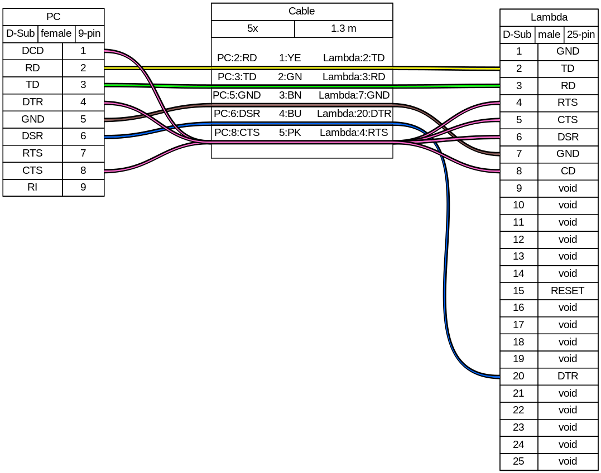

# Documentation Technique Lambda Capture

Ce document a pour but de décrire la manière dont les concepts de capture du Lambda 9 décrit dans le document général `Suppression d'imprimante du Lambda 9` ont été appliqués dans ce cas.

## 1 Le cable

Au moment de l'écriture de ce document, le câble est un cable sur mesure cable comme sur ce schéma:  
  

Cependant, il est très certainement possible de remplacer ce cable par un cable "DB9 DB25 null modem" standard.
L'essentiel étant que les signaux `CTS` `DTR` `CD` `DTS` de l'ordinateur et du Lambda 9 soient alimentés (par exemple par le `RTS`), et que les signaux `RD` et `TD` soient relié à leur opposé sur l'autre connecteur comme sur le schéma ci-dessus.

## 2 Simuler l'imprimante

Un programme qui ouvre la communication série et qui répond par `01\r` à chaque fois qu'il lit un `\r` est suffisant pour simuler une imprimante. _Attention, quand on commence à lire une chaine de characters sur le buffer d'entré, il faut la lire jusqu'à avoir lu le `\r` pour ne pas avoir des chaines découpés_

## 3 Analyser les données

Cette partie, décrite dans le document `Supression d'imprimante du Lambda 9`, n'est pas absolument nécessaire car on peut simplement demander a l'utilisateur de re rentrer les paramètres de mesures pour ne pas avoir à les chercher dans l'en-tête de la mesure.
La seul formule importante c'est la conversion des valeurs transmise en valeur mesurée:
$$		 \left ( \frac{Valeur - 416}{15936} \times (EchelleMax - EchelleMin) \right ) 
			\\ + EchelleMin = ValeurConvertie 
$$

## Le programme
Le programme détecte automatiquement grace a l'en-tête de la mesure quand une mesure est lancée, il détecte quand elle est finie et la traite automatiquement, il demande à l'utilisateur de rentrer les informations sur la mesure, comme le numéro de mesure l'échantillon mesuré...
Et il enregistre un fichier tableur `.xls` ayant toutes les informations sur la mesure.  

Le programme ne peut calculer la vitesse de balayage ainsi que la longueur d'onde mini uniquement si la valeur de `ABSCISSA FORMAT` est à 20nm/cm.  

## Alternative
Pendant mes recherches j'ai trouvé une solution qui proposait à l'aide d'un ordinateur doté d'un port parallel et d'une carte d'acquisition parallel supplémentaire, de simuler la station de données/contrôle du Lambda 9 à l'aide d'un logiciel de Ascanis non mis à jour et avec un cable à faire soit meme. Dans le doute de la suppression de la page du site et des ressource j'ai téléchargé toutes les informations nécessaire et je les ais stocké dans l'archive Lambda SPX.
Voici le lien du site <https://ftgsoftware.com/issues_lambda19.htm>

