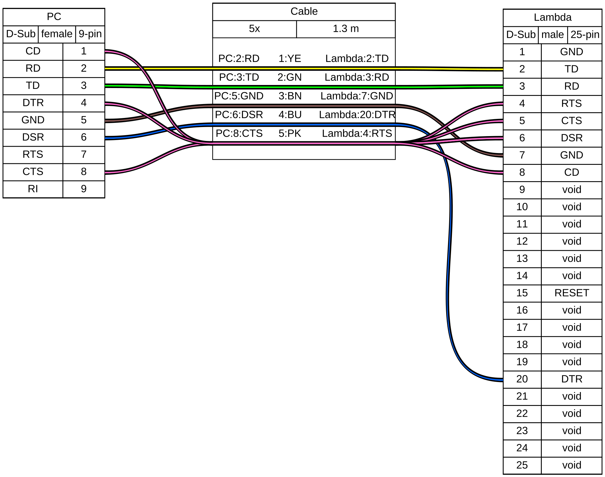

## Sujet de stage  

Programmation d'un logiciel de mesure d'irradiance(Flux Lumineux par unité de surface $W/m^2$) suite à une mise à jour matérielle.  

## Présentation de l'entreprise  
DR.FISCHER Europe est une société de développement et de fabrication de luminaire basée à Pont-à-Mousson. C'est une usine de DR.FISCHER GROUP qui produit des lampes Infrarouges, UV, Halogènes, LED et dans certains cas le système du luminaire complet incluant les réflecteurs.  
Le département Qualité dans lequel j'ai effectué mon stage a, entre autres, pour but de s'assurer de la qualité des lampes produites.  
Dans ce cadre ils sont amenées à utiliser des appareils de mesure pour vérifier la conformité des lampes produites.  
  
## Objectif du stage  
  
Dans le cadre de sa mission, le département Qualité fait des prélèvements de lampes en production et les teste sur différents aspects, notamment l'irradiance de ces lampes.
Ce qui est effectuée par le Banc de mesure XY.  
Ce Banc mesure l'irradiance de la lampe sur un quadrillage, ou une croix de points.
Il fait ça en déplaçant une cellule de mesure sur un axe X et un axe Y.
Les deux axes sont contrôlés par des moteurs pas à pas, qui sont branchés à un contrôleur.
Le contrôleur est branché à un ordinateur, sur lequel un programme LabVIEW interne à l'entreprise, envoie les commandes de déplacement.  
Il y à plusieurs cellules de mesures, pour différentes plages d'irradiance.  
  
  

En 2022 le contrôleur du Banc cesse de fonctionner.  
Il est remplacé par un nouveau contrôleur qui n'est plus compatible avec l'ancien programme LabVIEW.  
L'opérateur devais alors entrer manuellement les coordonnées dans le contrôleur, et lire les valeurs de l'irradiance sur l'ordinateur pour chaque point du quadrillage.  
Cela prend beaucoup de temps, ce qui pousse les demandes à être minimisée.  
Mon but est de faire à nouveau fonctionner le Banc de mesure XY.  
  
  
## Travail effectué  
  
### Banc XY  
  
L'ancien programme LabVIEW, qui date de 2008, possède plusieurs fonctionnalités qui ne sont plus nécessaire.  
J'ai trouver plus cohérent de repartir de zéro.  
Le choix de LabVIEW découle du fait que c'est le seul language de programmation que quelqu'un dans l'usine maîtrise, et de ce fais peut maintenir et modifier les programmes.  
Ne connaissant pas LabVIEW, j'ai passé les premiers jours à apprendre les bases de ce language (conditions, boucles, structures de données, fonctions etc...).  
C'est un language graphique, qui fonctionne par l'intermédiaire de blocs (VIs). Chaque VI effectue une opération, et les VIs transmettent les données entre eux avec des fils.  

  

  


Les programmes LabVIEW sont constitué d'un diagramme qui représente la partie programmation, et une face avant, qui représente l'interaction avec l'utilisateur, ou les VIs appelants.
Les entrés d'informations comme `x` et `y` sont appelées commandes, et les sortie comme `x*y` sont appelées indicateurs.

  
Une fois des connaissances de base acquises, je cherche comment communiquer avec le nouveau contrôleur.  
C'est un NewPort ESP302, il se branche en série sur l'ordinateur et communique avec le protocole RS232.  
Il reçoit des mots de commandes tels que `1PA100` pour déplacer l'axe 1 de 100mm.  
En premier lieu je réussi à envoyer des commandes depuis NI MAX, un utilitaire de LabVIEW.  
Il permet d'établir une communication sans avoir quelque chose à programmer, c'est donc pratique pour verifier que des paramètres fonctionne réellement.  
Ensuite j'essaie de faire la même chose depuis un programme LabVIEW.  
Après m'être rendu compte que les constantes de chaines de caractères en LabVIEW ne supporte pas par défaut les caractères échappées (`\r`), j'ai réussi à envoyer des commandes au contrôleur.  
  
Entre temps Alain, la personne chargée de faire des mesures avec le Banc actuellement, ma montré une mesure d'irradiance, actuellement Alain:  
1. Affiche la tension de la cellule de mesure en temps réel sur l'ordinateur  
2. Centre la cellule de mesure sur le centre de la lampe  
3. Allume la lampe  
4. Entre les coordonnées dans le contrôleur pour qu'il déplace la cellule  
5. Retient tension maximale qu'il voit à l'écran  
6. La note, et recommence pour chaque point du quadrillage ou de la croix.  
J'en ai profité pour poser des questions sur le fonctionnement du banc, et sur les besoins pour le nouveau programme.  
Il m'a montré les résultats de mesure de l'ancien programme, pour que je puisse les reproduire dans le nouveau.  
  
Par la suite je commence à noter les choses basique que doivent faire mon programme et que je ne sais pas encore faire:  
- Se déplacer en quadrillage ou en croix  
- Mesurer une tension de la cellule de mesure et la convertir en irradiance  
- Stocker les valeurs dans un fichier tableur  
  
Je commence par faire un programme qui se déplace en zig zag sur un quadrillage de points, ou en croix.  
Le programme sort une liste d'instructions pour le contrôleur en fonction du mode de déplacement choisi.  
  
A ce moment je me rend compte que si je veux faire une mesure précise, je doit attendre que les moteurs se soit arrêtés avant de mesurer la tension.  
Je commence à essayer de trouver une solution pour savoir quand les moteurs sont arrêtés.  
Le contrôleur ne renvoie pas de message pour dire qu'il a fini de bouger.  
Je me rabat sur la deuxième meilleur chose, je demande au contrôleur de m'envoyer son status après que le dernier axe ait fini de bouger.  
La structure de l'instruction devient donc `1PA-50;1WS;2PA-40;2WS;TS?\r` ou :  
- `PA` est une instruction de déplacement de coordonnées absolues de l'axe dont le nombre est situé avant  
- `-50` et `-40` sont les coordonnées ou l'axe doit se déplacer  
- `WS` demande d'attendre que l'axe dont le nombre est situé avant ait fini de bouger avant de passer à la commande suivante  
- `TS?` demande le status du contrôleur, le résultat n'est pas significatif car je m'en sert juste comme indicateur de fin de commande  
Le voici le déroulement de l'instruction:  
1. L'ordinateur écrit `1PA-50;1WS;2PA-40;2WS;TS?\r` sur le port série  
2. L'ordinateur attend de recevoir une réponse du contrôleur sur le port série  
3. Le contrôleur reçoit la commande et commence le déplacement l'axe 1 au coordonnées -50mm  
4. Le contrôleur attend que l'axe 1 ne bouge plus  
5. Le contrôleur déplace l'axe 2 au coordonnées -40mm  
6. Le contrôleur attend que l'axe 2 ne bouge plus  
7. Le contrôleur renvoie son status  
8. L'ordinateur reçoit le status et continue le programme  
  
Récupérer la tension de la cellule est simple, car il suffit d'envoyer une instruction `#01\r` sur un port série pour recevoir la tension.  
  
Il ne reste plus qu'à stocker des valeurs dans un fichier tableur.  
Encore une fois les fonctions de LabVIEW sont très pratiques, car il existe déjà une fonction qui permet de convertir un tableau en 2 dimensions en un fichier tableur.  
  
J'ai maintenant tout les éléments techniques nécessaires pour commencer le programme entier.  
Je fais donc une liste de toutes les fonctionnalités à implémenter et contraintes à respecter:  

- [ ] Choisir une dimension de mesure  28/02
- [ ] Choisir un pas de mesure  28/02
- [ ] Il faut que la distance soit un nombre pair pour pouvoir le diviser pour avoir des coordonnées de depart entière  28/02
- [ ] Les coordonnées min et max doivent être comprise entre les limites de déplacement du contrôleur (xxSL? Et xxSR?)  28/02
- [ ] Choisir entre mesure d'irradiance en croix ou en cartographie 29/02
- [ ] Bouton visualisation des informations de mesure calculé et ajusté (nombre de points, distance de mesure)  29/02
- [ ] Il faut que distance soit multiple du pas correspondant obtenir un nombre de point de mesure entier  01/03
- [ ] Il doit y avoir un passage par 0, donc il faut que distance/2 soit multiple du pas correspondant  01/03
- [ ] Générer liste d'instruction, et afficher liste de coordonnées avant de lancer la mesure  01/03
- [ ] Barre de progression  04/03
- [ ] Opérateur  05/03
- [ ] Nom de la source mesuré (nom de la lampe)  05/03
- [ ] Ref de la source mesuré (ref de la lampe)  05/03
- [ ] Tension fournie moyenne  05/03
- [ ] Intensité fournie moyenne  05/03
- [ ] N° SQ (indiqué en haut de la feuille de demande de mesure)  05/03
- [ ] Designation de la cellule de mesure  05/03
- [ ] Temperature de la cellule de mesure  05/03
- [ ] Distance lampe cellule  05/03 
- [ ] Temps de pause pour mesure  5/03
- [ ] Tension alim ±(commentaires sur ancienne mesures)  05/03
- [ ] Puissance (commentaires sur ancienne mesures)  05/03
- [ ] Intensité (commentaires sur ancienne mesures)  05/03
- [ ] Bouton voir tension cellule de mesure en direct  05/03
- [ ] Bouton aller au zero  05/03
- [ ] Bouton mettre a zero a cette position  06/03
- [ ] Boutons déplacer le chariot de 5mm  06/03
- [ ] Date de mesure  06/03
- [ ] Tableau d'irradiance calculé en fonction de la designation de la cellule de mesure  06/03
- [ ] Handling des erreurs du boitier ESP302 07/03 

  
Je commence par intégrer la possibilité de choisir les dimensions de la mesure ainsi que le pas de déplacement.  
C'est a dire qu'on peut choisir la distance sur laquelle la mesure sera effectuée sur les deux axes, ainsi que la distances entre chaque points de mesure.  
Comme on mesure l'irradiance d'une lampe, il est important de passer par le point le plus lumineux de la lampe, souvent au centre de la lampe, au 0.  
Il faut donc que le programme vérifie que la combinaison de dimensions et de pas de déplacement permettent de passer par le 0.  
Et d'ajuster si ce n'est pas le cas.  
Il faut que:  
- La distance soit un nombre pair, pour pouvoir la diviser par 2 et avoir des coordonnées négatives et positives entières  
- La distance divisée par 2 doit être multiple du pas pour que l'un des points de mesure soit le 0  


J'ajuste donc les distances au supérieur si ce n'est pas le cas. Ex:  
Distance = 65, pas = 10  
On ajuste la distance à 80 car $80/2 = 40$ et 40 est multiple de 10.  
  
Une fois les dimensions ajustées, on les affiches à l'écran pour ,que l'utilisateur puisse vérifier que c'est bien ce qu'il veut.  
J'ai aussi affiché les coordonnées de tout les points de mesures, ainsi que le nombre de points après ajustement.  
  
A ce point le programme prend des dimensions et des pas, offre le choix de faire une cartographie ou une croix, affiche les coordonnées des points de mesures, et ajuste les dimensions si besoin.  
On peut lancer le déplacement, et la cellule bouge sur toute les coordonnées.  
  
Pour enregistrer les valeurs dans un tableau excel, il faut d'abord savoir ou les stocker dans le tableau.  
Avec le déplacement en zig zag et le déplacement en croix, je devrais avoir deux méthode de calcul de coordonnées à chaque fois que j'enregistre une valeur.  
J'ai résolu ce problème en enregistrant pour chaque instruction de mesure au moment de sa création les coordonnées d'enregistrement dans le tableau. A ce moment là du programme je sais exactement ou sera la cellule, il est donc logique de définir ou la stocker dans le tableau à ce moment là.  
  
 J'ai les données d'irradiance, il ne me reste plus qu'à ajouter les informations relatives à la mesure, comme le nom de l'opérateur, la date de la mesure, le numéro de mesure spécial, infos sur la lampe etc...
Je fait donc un menu pour entrer ces informations, et je trouve un moyen de les formater pour les stocker dans le fichier tableur, ce qui n'est pas facile car LabVIEW n'a pas de fonction intégré pour écrire des informations textuel dans un fichier tableur, je formate donc les informations avec des spécificateurs de format, un peu comme en C avec la fonction `printf`.
Cela apporte l'avantage d'être facile à concevoir, mais l'inconvénient de ne pas produire un diagramme très lisible.

  
  
Le seul élément manquant avant d'avoir une première version fonctionnelle est de pouvoir choisir la sonde de mesure utilisé pour que la conversion de la tension en irradiance soit correcte. 

Pour ça j'ai choisi d'utiliser un fichier de configuration qui contenait les informations des valeurs de conversion pour chaque cellule. Associé à un menu déroulant pour choisir la cellule, le logiciel peut maintenant convertir les tensions en irradiance.  

À partir de là, la version très rudimentaire (l'interface graphique n'est pas pratique à utilisé, aucune facilitation de l'expérience utilisateur) du programme est fonctionnelle.
On peut choisir les dimensions, les pas, le type de mesure, rentrer les informations de la mesure, lancer la mesure, et enregistrer les données dans un fichier tableur.

Avec les fonctionnalités de bases implémentées, je dresse une liste des choses à améliorer et à rajouter:
- Améliorer l'interface graphique
- Flèches de déplacement de la cellule, de mise à zéro pour le centrage de la cellule par rapport à la lampe
- Limite sur les données entrées par l'utilisateur
- Commentaires dans le code

Je fait des croquis de l'interface graphique et je regarde quelque sites web et logiciels pour m'inspirer.
Je finis par regrouper certaines fonctionnalités ensemble en fonction de leur types, et je les places dans des onglets pour les délimités.

Le premier onglet sert à choisir les dimensions, les pas de déplacement et le type de mesure (cartographie ou croix) ainsi qu'a visualiser les coordonnées de mesure et le nombre de points.
Le deuxième onglet sert à entrer les informations de la mesure qui n'influe pas sur le déroulement de la mesure, sauf le temps de pause pour mesure (temps pendant laquelle la cellule reste immobile et la tension est mesurée en continue pour avoir la valeur maximale).
Le troisième onglet est l'onglet des contrôles, il permet de voir la tension de la cellule en direct, de déplacer la cellule et de lancer la mesure.

  

Je rajoute des boutons pour déplacer la cellule, et pour mettre le zéro à l'endroit ou la cellule est actuellement.
Cela permet de pouvoir bouger la cellule sans avoir à utiliser l'interface peu pratique du contrôleur.

Je rajoute des limites sur les données entrées par l'utilisateur qui influe sur la mesure, pour éviter les divisions par 0, les nombres négatifs pour des valeurs qui doivent être positives etc... Cela ne se fait pas dans le code mais dans les propriétés des commandes sur la face avant.

Je commence aussi à mettre des commentaires dans le code qui jusqu'à présent ne servait que de test pour les différentes fonctionnalités.

Le programme est maintenant dans une première version utilisable.  Charles, organise alors une démonstration du programme en faisant une mesure sur une lampe avec tout les gens concernés par le Banc XY.
Après la mesure, les gens présents ont fait des retours sur le programme, et j'ai noté les points à améliorer:
- Pouvoir déplacer la cellule et afficher la tension en même temps
- Formatter les données de mesures d'irradiance en croix différemment dans le tableur
- Afficher le graphe d'irradiance en temps réel
- Réduire la taille du diagramme des VIs

Tout ces points sont intrinsèquement liés à la conception du programme.

LabVIEW est un language graphique très loin des language plus classique comme Java, Python ou PHP avec lequel je suis familier.
J'ai eu du mal à appliquer les principes de conception et de programmation que j'ai appris, car ce n'est pas de la programmation impérative et textuelle.
Pour faire passer une information d'un endroit à un autre, on ne le met pas dans une variable qu'on référence à un autre endroit, on tire un fil entre les deux endroits. 
Cela rend le programme très illisible car on doit remonter la source du fil pour savoir d'où vient l'information.
Si le VI dépasse la taille de l'écran il faut alors se déplacer sur le diagramme ce qui rend le debug age assez compliqué.
Comme les données commence toute dans des commandes, et que ces commandes sont situés sur une seul face avant, elle sont toutes présente dans le diagramme.
La présence d'autant d'informations rend le diagramme illisible car on doit tirer un fil de chaque commande jusqu'à chaque VI qui va la traiter.
Le diagramme ressemble à ça


  


Il faut donc trouver un autre moyen de faire transiter les données.
Il faut aussi trouver un autre moyen de gérer les actions des boutons.
Pour l'instant les actions sont gérés par des si dans une boucle tant que qui boucle par intervalle de temps. Si il y a un bouton pressé et qu'il exécute du code, alors tout les autres boutons sont bloqués.

La première solution qui m'est venue en tête pour gérez les actions c'est les "Event listeners", il existe quelque chose de similaire dans LabVIEW, les structures d'évènements.
Elles permettent de définir l'exécution de code en fonction d'évènements configurés.
Cela permet d'avoir plusieurs boutons clickable en même temps, ce qui résout le problème d'afficher la tension et de pouvoir bouger en meme temps.

Le deuxième problème est le nombre de fil et leur longueur qui rende le tout illisible.
Pour diminuer le nombre de fils allant de VI à VI je decide d'utiliser des clusters, ce sont des structures de données comme des objets mais on n'y stocke pas de fonctions ou de méthode.
Cela permet de réduire le nombre de fil se baladant d'un vi à l'autre mais pas à l'intérieur meme d'un vi, en effet si on veut traiter les données, il faut inévitablement tirer fil qui va du dégroupement du cluster jusqu'au VI traitant les données.
Cela sert donc simplement à réduire la taille des VI, pas vraiment leur complexité.  

  

Mais le fait de ne plus avoir à trop se déplacer pour voir d'où vienne les informations est déjà une grosse amélioration par rapport au VI qui faisait 5 écrans de large.

Ces avancées, combinées au fait de diviser le programme en encore plus de sous-VIs font que la lisibilité à grandement augmenté

Une fois ces changements effectuées, la modification du programme est devenu plus simple, ce qui m'a permit de rapidement modifier le formatage des données des mesures en croix dans le tableur, et d'ajouter un graphe d'irradiance en direct lors de la mesure, qui permet de verifier visuellement que la mesure se déroule comme prévue (voir si il y à une chute inattendue d'irradiance lors de la mesure).

A ce moment j'ai considéré les problèmes comme réglés, on a donc fait un autre test qui à révélé qu'il fallait aussi intégrer la courbe du multimètre en directe pour surveiller les potentiels chutes de tension faussant la mesure.

Et après ça seulement un seul bug à été rapporté, il s'agissait du VI qui attendait d'avoir le status du contrôleur pour passer à la suite qui ne fonctionnait pas toujours.
Les étapes de déroulement était:
- On envoie une instruction au programme
- Quand on détecte que le buffer de sortie n'est pas vide on s'arrête

Le problème était que le programme s'arrêtait juste après avoir envoyé l'instruction.
Le plus bizarre étant que le problème ne subvenait plus si on mettait un temps d'attente entre la détection du buffer non vide et l'arrêt.
Alors que normalement une fois que le buffer non vide est détecté le programme devrait s'arrêter immédiatement, la seul différence et 35ms d'attente après avoir détecté que le buffer n'est pas vide.

Après ce bug corrigé, le programme était considéré comme fini, et je rédige la documentation utilisateur pour étaler clairement le déroulement des étapes et quoi faire en cas de problème.
J'écris la documentation technique qui décrit le système et ces particularités.
J'ai finalement terminé d'écrire les commentaires du programme.

A ce moment là, le Banc XY est fonctionnel.

### Conversion des fichiers du goniomètre  ###  

#### Problème ####    

Le goniomètre, est un appareil qui permet de mesurer l'éclairement (Lux) d'un luminaire, à différents angles horizontaux et verticaux, pour avoir une "map" d'éclairement.  
Cela permet ensuite de visualiser la zone d'éclairement du luminaire dans un logiciel spécialisé, Dialux.  
Le problème est que pour l'instant le logiciel contrôlant le goniomètre sort un fichier tableur très simple avec les valeurs pour chaque coordonnées d'angles, et ce fichier n'est pas compatible avec Dialux.  
Dialux prend un fichier `.ies` respectant la norme `ANSI/IESNA LM-63-02`.  
Pour l'instant la conversion est faite manuellement, ce qui prend beaucoup de temps et est très minutieux.  

Ma tâche est de faire un programme qui convertisse le fichier tableur en fichier `.ies` respectant la norme `ANSI/IESNA LM-63-02`.  


#### Mon travail  ####   

Je commence par lire la norme `ANSI/IESNA LM-63-02` pour comprendre ce que je dois faire.
Le document est long mais très détaillé, ce qui me facilitera la tâche car il ne laisse aucune place au doute.  
Je note les points importants pour la conversion:

- L'en-tête du fichier doit contenir des informations sur le luminaire, la date de la mesure, le fabriquant etc...
- Ensuite il y a des valeurs séparé par des virgules qui corresponde au nombre d'angles verticaux et horizontaux, informations diverse sur la mesure et le goniomètre etc...
- Enfin il y a les valeurs d'éclairement d'angle verticaux pour un angle horizontal par ligne
- Toutes les combinaisons d'angles de départ et d'arrivée ne sont pas possible

La manière dont est formaté les angles dans le fichier `.ies` est assez différente du fichier d'origine, selon les angles de départ et d'arrivé choisi sur la mesure il faut manipuler le tableau différemment.  
Les valeurs d'angles de départ et d'arrivées autorisé par la norme pour les angles verticaux et horizontaux sont les suivantes:

- 0;90
- -90;90

Cela laisse 6 combinaisons d'angles de départ et d'arrivés possibles, ainsi que les opérations qu'il faut faire sur le tableau pour qu'il respecte la norme: 

- 0;90 On ne fait rien
- 0;-90 On converti les valeurs d'angles en valeur absolue
- 90;0 On renverse le tableau, angles et valeurs comprises
- 90;-90 On renverse le tableau, angles et valeurs comprises
- -90;0 On renverse le tableau, angles et valeurs comprises et on converti les valeurs d'angles en valeur absolue
- -90;90 On ne fait rien

Avec ça j'ai tout les elements nécessaire pour commencer le programme.  
Le programme est aussi fait avec LabVIEW, toujours pour la même raison, c'est le seul language de programmation que quelqu'un dans l'usine maîtrise.  
Le programme et en soit assez simple une fois qu'on à compris comment manipuler les angles et les valeurs.
Le reste est du formatage d'entrée d'utilisateur en informations conforme à la norme. 
Tout au long du développement j'utilise un fichier de mesure avant et après conversion pour vérifier que le programme fonctionne bien.
Une fois terminé j'envoie le fichier converti avec mon programme à quelqu'un qui peut verifier sa validité avec le logiciel Dialux.  
Ce travail plutôt cours ne m'a pris que 3 jours.

### Lambda 9 ###

#### Problème ####

Le Lambda 9, de Perkin-Elmer, est un spectrophotomètre qui permet de mesurer des valeurs de transmission, réflexion et absorption de différents matériaux dans le domaine de l'UV, visible et IR.  
C'est une machine datant des années 80, elle imprime la courbe de donnée par une imprimante thermique spécifique au Lambda 9.
La pointe chauffante de l'imprimante est cassé, et il est impossible de trouver une pièce de rechange.
La solution temporaire est d'attacher un stylo bic à la place de la pointe chauffante.  
De plus pour avoir les résultats en format tableur exploitable, il faut scanner la feuille imprimée, délimiter les axes, les valeurs et un programme analyse l'image et en extrait les données.
Cela prend beaucoup de temps et peut introduire des imprécisions.  

#### Mon travail ####

Il est dans l'idée de remplacer l'imprimante thermique par un ordinateur, doté d'un programme qui émulerait l'imprimante et enregistrerait les données dans un fichier tableur.  
Pour ce faire Florian, l'initiateur du projet, a acheter un convertisseur parallèle/USB pour connecter l'ordinateur au Lambda 9.
Cependant il c'est vite avérée que ce n'était pas si simple que ça.  
Les port parallèles ne sont pas fait pour émuler une imprimante.
Quand je me rend compte de cela je commence à chercher des solutions pour émuler une imprimante avec un port parallèle.
Je trouve rapidement quelque produits qui permettent de faire ça, mais du à l'age du Lambda 9 ainsi que le fait que l'imprimante soit spécifique au Lambda 9, je doute fortement de la compatibilité de ces produits avec le Lambda 9.  
C'est à ce moment que Olivier me donne un "HP 4951C Protocol Analyzer".
C'est un appareil qui permet d'intercepter les données qui passent entre deux appareils, et de les afficher.

  

  


Malgré le fait que l'imprimante soit connectée au Lambda 9 avec un cable DB25, le même port utilisé habituellement pour les imprimantes, ce n'était pas un protocol de transmission de données en parallèle qui était utilisé mais le protocole série RS232.
Je m'en suis rendu compte après avoir fait fonctionné le protocol analyzer et avoir vu que c'était bien marqué RS232 sur le boitier.  
Une fois le protocol analyzer branché sur la connexion Lambda 9 -> imprimante avec un cable Y, il à pu faire une détection automatique des paramètres de communications, et afficher les données qui passaient entre les deux appareils.

Pour l'instant on voit les données, mais elles sont sur le protocol analyzer et l'imprimante doit toujours être branchée pour les voir.
Dans le manuel du protocol analyzer il est marqué qu'on peut simuler un DCE ou un DTE.
Cela correspond exactement à ce qu'on veut faire, simuler une imprimante.
J'ai d'abord réussi à simuler le Lambda 9 avec l'imprimante, et je réussissait à la faire imprimer des données.  
J'ai mis plus de temps à comprendre comment simuler l'imprimante avec le Lambda 9, car je n'avais pas compris que le Lambda 9 attendait une répons à la fin de chaque chaine de caractères.
En ayant observée la communication entre le Lambda 9 et l'imprimante, je configure donc le protocol analyzer pour simuler l'imprimante avec ce programme:

```  
Simulate DCE  

// on allume les signaux DSR CD et CTS pour dire que l'imprimante est prête
Block 1  
Set Lead DSR On  
	and then  
Set Lead CD On  
	and then  
Set Lead CTS On  
	and then  
Send F,00\r  // instruction qu'envoi l'imprimante 
  
Block 2  
When DTE \r  // quand le Lambda 9 envoi un retour chariot
	then goto Block 3  // on va à l'étape suivante
  
Block 3  
Send 01\r  // on envoie l'instruction qui dit que ça c'est bien passé
	and then  
Goto Block 2  // on revient à l'étape précédente pour attendre un retour chariot
```  

Ce programme simule l'imprimante qui au démarrage envoie la chaine `F,00\r`, et qui répond `01\r` quand le Lambda 9 lui envoie un retour chariot.  
Le programme fonctionne, quand on débranche l'imprimante, le Lambda 9 envoie les données au protocol analyzer.

J'ai réussi à confirmer que l'émulation de l'imprimante et la capture des données était possible.
Maintenant il faut le faire sur un ordinateur pour récupéré les données.  

Pour ça j'ai installé un ordinateur et j'ai commencé à essayer de le faire communiquer avec le Lambda 9.
Malgré un programme qui réplique exactement ce que fait le protocol analyzer, je n'arrive pas à faire fonctionner la communication.  
Après avoir lu les dessins techniques du port imprimante présent dans le manuel du Lambda 9 je me questionne sur l'adaptateur DB25 -> DB9 que j'utilise pour connecter l'ordinateur au Lambda 9. 
En regardant le câblage de l'adaptateur je me rend compte que les fils de données ne sont pas croisés, le Lambda 9 envoie les données sur le même câble ou l'ordinateur les envoies, idem avec les données reçues.
Il fallait utiliser un cable null modem pour connecter l'ordinateur au Lambda 9.
La raison est que ce sont deux DTE qui communiquent ensemble, il faut croiser les fils de données pour que les données de l'un aillent dans les données de l'autre.  
J'ai trouvé le câblage fonctionnel à terme de nombreuses experimentations avec des adaptateurs, des cables et des câblages différents, encore une fois grâce au protocol analyzer qui permet d'utiliser des jumpers pour créer son propre câblage.  


Ce câblage est constitué d'un cable null modem classique qui croise les fils de données, et de 3 jumpers qui permettent d'alimenter les signaux DSR, CD et CTS du Lambda 9.
Sans ces signaux le Lambda 9 ne détecte pas la présence d'une imprimante et ne communique pas.  

Ce câblage est fonctionnel mais il est constitué de plusieurs convertisseurs et des parties qui ne sont pas sensée rester la sur le long terme.
Je soude un cable ayant le meme câblage pour pouvoir remplacer le système temporaire.  

  

  


J'ai maintenant un ordinateur qui reçoit les données du Lambda 9.
Avant de commencer à écrire un programme convertit les données en tableur, je doit analyser les données reçues pour comprendre comment elles sont formatées.  

C'est des chaines de caractères ASCII qui disent à l'imprimante quoi imprimer et comment.
Ces chaines ne corresponde pas à un language d'imprimante standard, c'est spécifique au Lambda 9.  
En voici un court extrait:  

```
Z0
IT,Z0,F15936,416,0,200,D0128,1280,A1,X2100,-100,5,S2090.0,D1,1,Y110.0,-22.000,4,Z0,D0128,1280,L1
14370
14357
T,D-1,1,Y110.0,-22.000,4,A0,M0,50,V-2
A0,T,V-2
```

Mon but est de pouvoir déduire tout les éléments essentiel de la mesure, comme la longueur d'onde maximum et minimum, l'échelle maximum et minimum, la vitesse de scan et bien sur les valeurs mesurées.  
Je procède méthodiquement en faisant de nombreuses mesures en ne changeant qu'un seul paramètre sur le Lambda 9 à chaque fois pour voir qu'est ce qui change dans les informations transmises à l'imprimante.
Après plus de 100 mesures, je parvient à déduire les informations nécessaires des données transmises. Et je rédige un document détaillant quelles paramètres du Lambda 9 change quel valeurs dans les données transmises et quel est la formule pour le convertir. Exemple:  
(Exemple de page du rapport Lambda avec les formules de conversion)  

Après ça je créer un programme LabVIEW qui parse les données, fait les conversion nécessaires et les formate en tableur.
A ce moment je commence à bien comprendre LabVIEW, j'ai déjà fait le programme du BancXY et celui du Goniomètre.
Le développement est assez rapide et sans surprise.

Après une demo avec les utilisateurs finaux, et le développement de modification demandé, le projet est terminé.  

### Panne ordinateur ###

Au début de la 3ème semaine, après avoir fait la demo du Banc XY, l'ordinateur du Banc XY est tombé en panne.
Il s'arrêtait de fonctionner au bout de quelque instants après avoir démarré.
J'ai essayé de nombreuses solutions pour le réparer, comme changer les composants, les cables, etc.
J'ai fini par diagnostiquer une carte mère morte.
Malheureusement à cause de la licence de LabVIEW qui est liée à la carte mère, il était impossible de changer la carte mère en gardant la même licence.
C'est tombé la semaine ou aucun des deux responsables informatique n'était là, il était impossible de changer l'ordinateur ou de rectifier la licence LabVIEW.  
J'ai donc passé la semaine à travailler sur le programme du Banc XY sur un autre ordinateur, mais sans pouvoir le tester avec le Banc XY.  
La réinstallation de LabVIEW sur un ordinateur plus récent la semaine d'après n'a pas été de tout repos non plus.
Il à fallu réinstaller Windows pour outrepasser l'antivirus qui bloquait le lecteur CD.  


Le lien avec l'informatique n'est pas assez clair
connaissances informatiques qui m'ont permit de débloquer la situation
en plus qu'une personne en mesure physique

